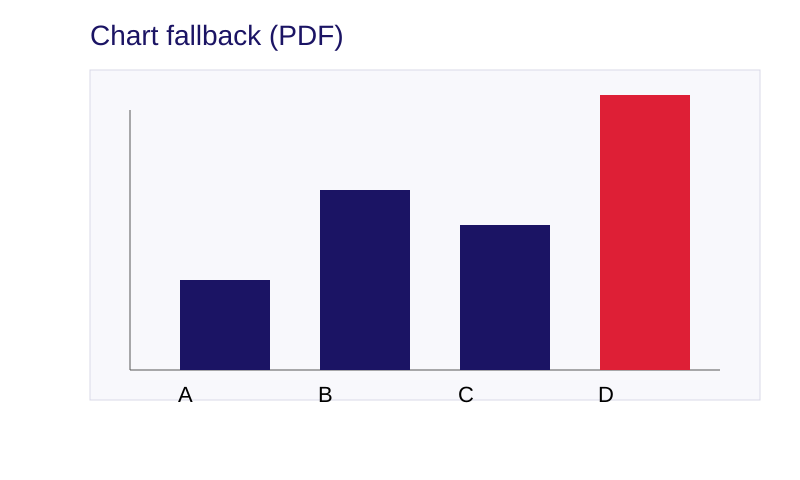

<!-- Importa le librerie Vega per chart interattivi -->
<script src="https://cdn.jsdelivr.net/npm/vega@5.30.0"></script>
<script src="https://cdn.jsdelivr.net/npm/vega-lite@5.21.0"></script>
<script src="https://cdn.jsdelivr.net/npm/vega-embed@6.26.0"></script>
<script src="template/js/vega-insert-chart.js"></script>


<!-- _class: cover -->
<!-- _paginate: skip -->

<div>
  <h1>Marp Template</h1>
  <h2>Esempio di Presentazione</h2>

  <div class="authors">
    <div class="author-label">autore</div>
    <div class="author-name">Nome Cognome</div>
    <br>
    <div class="author-label">organizzazione</div>
    <div class="author-name">Università o Azienda</div>
  </div>

  <div class="university">
    <strong>Marp Template v1.0</strong><br>
    Template per presentazioni professionali<br>
    Anno: 2025    
  </div>
</div>

<div class="cover-image">
  
</div>

---

# Benvenuto! 👋

Questo è un esempio di presentazione creata con il **Marp Template**.

Il template include:
- ✨ Temi personalizzati
- 🎨 Font professionali (IBM Plex)
- 📊 Supporto per chart Vega-Lite
- 📐 Layout flessibili
- 🖼️ Classi predefinite per slide speciali

---

<!-- _class: chapter -->
<!-- _paginate: skip -->

# 1. Layout di Base (sections)

---

<!-- _class: columns-1 -->

## Layout a Singola Colonna

Questo layout usa la classe `columns-1` che restringe il contenuto con un padding a destra del 25%.

Utile per:
- Testi più leggibili
- Focus sul contenuto
- Presentazioni narrative

---

<!-- _class: columns-2 -->

<div>

### Colonna Sinistra

- Punto 1
- Punto 2
- Punto 3

Lorem ipsum dolor sit amet, consectetur adipiscing elit.

</div>

<div>

### Colonna Destra

- Punto A
- Punto B
- Punto C

Sed do eiusmod tempor incididunt ut labore et dolore magna aliqua.

</div>

---

<!-- _class: columns-3 -->


<div>

### Colonna 1

- Punto 1
- Punto 2
- Punto 3

</div>

<div>

### Colonna 2

- Punto A
- Punto B
- Punto C

</div>

<div>

### Colonna 3

- Punto X
- Punto Y
- Punto Z

</div>

---

<!-- _class: columns-4 -->


<div>

**Q1**

Dati primo trimestre

</div>

<div>

**Q2**

Dati secondo trimestre

</div>

<div>

**Q3**

Dati terzo trimestre

</div>

<div>

**Q4**

Dati quarto trimestre

</div>

---

<!-- _class: chapter -->
<!-- _paginate: skip -->

# 2. Layout di Base (custom)

---

# Slide Standard

Questa è una slide standard con:

- **Elenchi puntati** per organizzare le informazioni
- `Codice inline` per evidenziare elementi tecnici
- Testo con <mark>evidenziazione</mark> per concetti chiave

Puoi anche inserire link: [Documentazione Marp](https://marp.app/)

```python
# Esempio di blocco codice
def hello_world():
    print("Hello from Marp!")
```

---

# Layout a Due Colonne

<div class="columns-2">

<div>

**Colonna Sinistra**

Qui puoi inserire:
- Testo
- Elenchi
- Immagini
- Codice

</div>

<div>

**Colonna Destra**

E qui altro contenuto complementare:
- Confronti
- Esempi
- Grafici
- Note

</div>

</div>

---

# Layout a Tre Colonne

<div class="columns-3">

<div>

**Prima**
- Item A
- Item B

</div>

<div>

**Seconda**
- Item X
- Item Y

</div>

<div>

**Terza**
- Item 1
- Item 2

</div>

</div>

---

<!-- _class: chapter -->
<!-- _paginate: skip -->

# 3. Elementi Speciali

---

# Testo Evidenziato

Usa `<mark>` per evidenziare concetti importanti:

Il template supporta <mark>elementi chiave</mark> che catturano l'attenzione.

---

# Testi di Dimensioni Diverse (titolo)

## Sottotitolo

### Testo di terzo livello

Testo normale per il contenuto principale.

<p class="small-text"> Testo piccolo per note, disclaimer o informazioni secondarie.</p>

<div class="caption">Testo caption per didascalie o citazioni. </div>

---

# Citazioni e Separatori

> "Il design non è solo come appare e come si sente.  
> Il design è come funziona."  
> — Steve Jobs

---

Separatore orizzontale per dividere sezioni:

<hr>

**Prima sezione**

Contenuto della prima parte

<hr>

**Seconda sezione**

Contenuto della seconda parte

---

<!-- _class: title-slide -->
<!-- _paginate: skip -->

# Slide Titolo Sezione


---

<!-- _class: chapter -->
<!-- _paginate: skip -->

# 4. Immagini e Media

---

# Immagini

Le immagini possono essere centrate usando `![center]`:


<div class="caption">
Didascalia dell'immagine
</div>

---

# Immagini in Colonne

<div class="columns-2">

<div>


<div class="caption">Prima immagine</div>

</div>

<div>


<div class="caption">Seconda immagine</div>

</div>

</div>

---

<!-- _class: all-image -->

# Slide con Sfondo

## Sottotitolo opzionale


---

<!-- _class: chapter -->
<!-- _paginate: skip -->

# 5. Tabelle e Dati

---

# Tabelle

| Colonna 1 | Colonna 2 | Colonna 3 |
|-----------|-----------|-----------|
| Dato A    | 100       | ✅        |
| Dato B    | 200       | ✅        |
| Dato C    | 150       | ❌        |

<div class="caption">
Esempio di tabella con dati
</div>

---

# Tabella con Testo Piccolo

<div class="small-text">

| Feature | Standard | Premium | Enterprise |
|---------|----------|---------|------------|
| Users | 10 | 100 | Unlimited |
| Storage | 10GB | 100GB | 1TB |
| Support | Email | Priority | 24/7 |
| Price | $10/mo | $50/mo | Custom |

</div>

---

<!-- _class: chapter -->
<!-- _paginate: skip -->

# 6. Chart Interattivi

---

# Chart Vega-Lite

Esempio di chart interattivo (visibile solo nella versione HTML):

<div class="columns-2">

<div>

**Caratteristiche:**
- Interattivo su HTML
- Statico su PDF
- Facile da integrare
- Basato su JSON

</div>

<div>

<div class="interactive-chart" id="example-chart"></div>
<div class="img-chart">
  
</div>

<script>
insertChart('example-chart', './assets/charts/example-chart.json', '100%', '300px');
</script>

</div>

</div>

---

<!-- _class: chapter -->
<!-- _paginate: skip -->

# 7. Best Practices

---

# Consigli per Slide Efficaci

<div class="columns-2">

<div>

**DO ✅**
- Una idea per slide
- Testo conciso
- Immagini significative
- Contrasto adeguato
- Dimensioni leggibili

</div>

<div>

**DON'T ❌**
- Troppo testo
- Troppe informazioni
- Font piccoli
- Colori poco contrastati
- Troppi effetti

</div>

</div>

---

# Organizzazione dei Contenuti

1. **Introduzione chiara**
   - Presenta il topic
   - Definisci gli obiettivi

2. **Sviluppo strutturato**
   - Usa capitoli (slide `chapter`)
   - Mantieni coerenza visiva

3. **Conclusione efficace**
   - Riassumi i punti chiave
   - Call to action

---

# Accessibilità

Ricorda di:
- Usare **alto contrasto** tra testo e sfondo
- Usare **dimensioni leggibili** (min 18pt)
- Limitare le **animazioni** eccessive
- Testare su **diversi dispositivi**

---

<!-- _class: chapter -->
<!-- _paginate: skip -->

# 8. Varianti di Tema

---

# Altri Temi Disponibili

Questo template include diversi temi:

- **master** (corrente): Blu/rosso, IBM Plex, professionale
- **alma**: Giallo/nero, Poppins, moderno

Per cambiare tema, modifica il front matter:

```yaml
---
marp: true
theme: alma  # invece di master
---
```

---

<!-- _class: all-image -->

# Grazie! 🙏

## Inizia a creare le tue presentazioni


---

# Risorse e Collegamenti

<div class="columns-2">

<div>

**Documentazione**
- [Marp](https://marp.app/)
- [Vega-Lite](https://vega.github.io/vega-lite/)
- [Markdown Guide](https://www.markdownguide.org/)

</div>

<div>

**Template**
- GitHub: your-repo/marp-template
- README completo
- Esempi inclusi

</div>

</div>

---

<!-- _class: all-image -->

# Buon lavoro! 🚀


